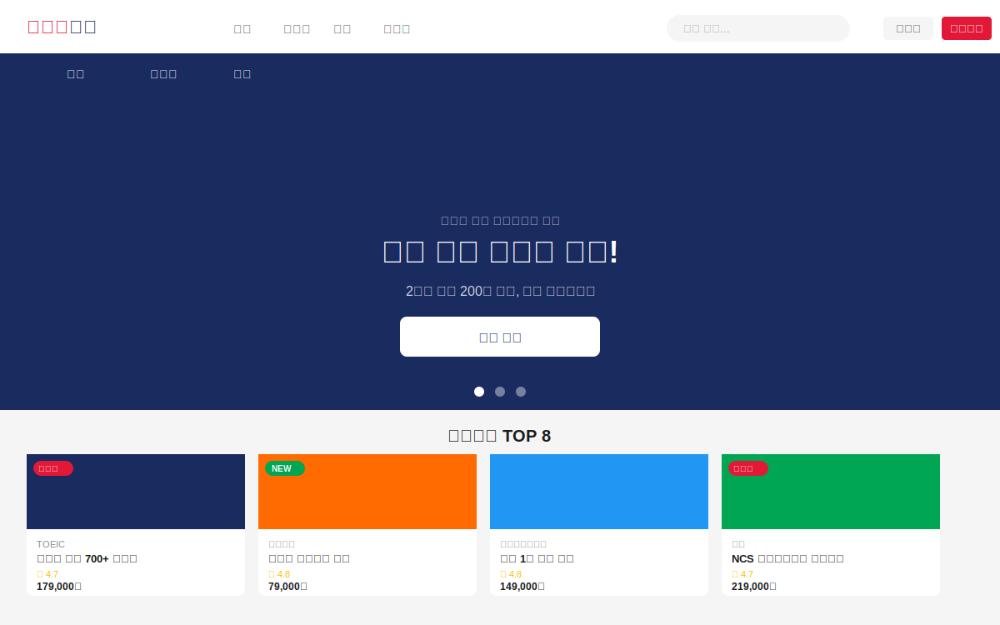
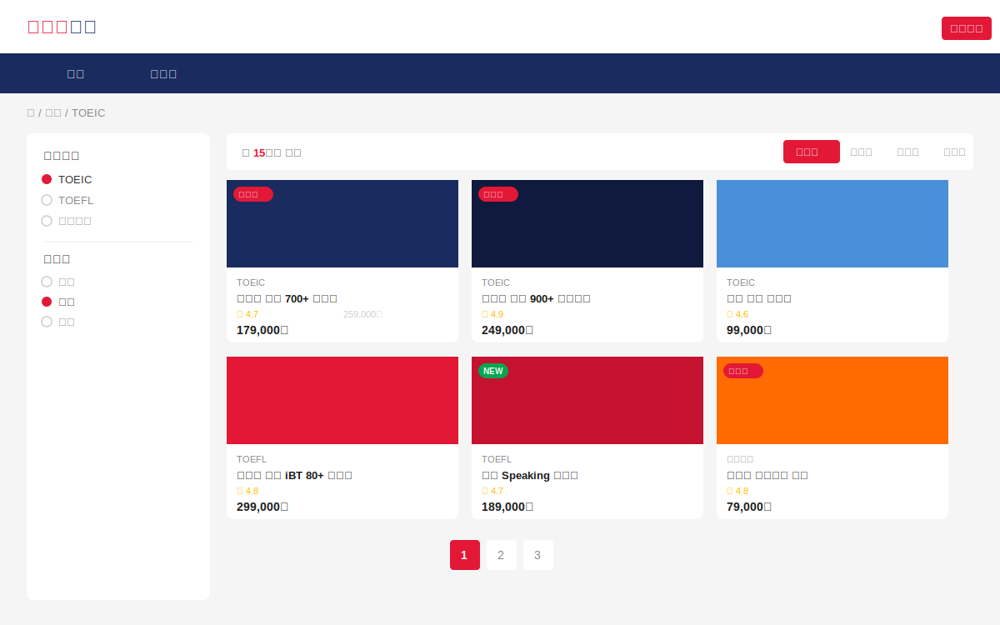
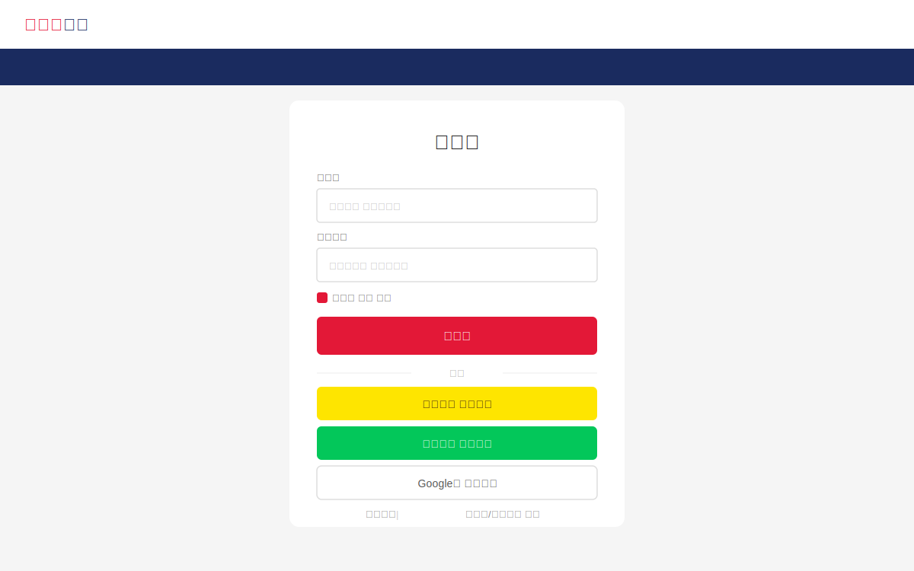

<div align="center">

# 해커스교육 웹사이트 클론
### Hackers Education Web Platform

[](https://vuejs.org/)
[](https://vitejs.dev/)
[](https://sass-lang.com/)
[](./LICENSE)

**[🚀 라이브 데모 보기](https://heralife.github.io/vue-scss/)**

</div>

---

## 📸 스크린샷

### 메인 홈 페이지


### 강의 목록 페이지


### 강의 상세 페이지


### 로그인 페이지


---

## 🛠 기술 스택

| 분류 | 기술 | 버전 |
|------|------|------|
| 프레임워크 | Vue.js (Composition API) | ^3.5.0 |
| 빌드 도구 | Vite | ^6.0.0 |
| 라우터 | Vue Router | ^4.5.0 |
| CSS 전처리기 | SCSS (Dart Sass) | ^1.83.0 |
| 상태 관리 | Vue Reactive (Pinia 미사용) | - |
| 폰트 | Pretendard Variable | CDN |

---

## 📁 프로젝트 구조

```
src/
├── router/          # Vue Router 설정, 네비게이션 가드
├── assets/scss/     # 디자인 시스템 (변수, 믹스인, 리셋)
├── data/            # Mock 데이터 (강의, 강사, 리뷰, 이벤트)
├── composables/     # Composition API 훅
├── stores/          # 전역 상태 (인증, 장바구니)
├── utils/           # 포맷터, 유효성 검사
├── components/
│   ├── layout/      # Header, Footer, CategoryNav, TopBanner
│   ├── common/      # Base 컴포넌트 (Button, Input, Modal 등)
│   ├── home/        # 홈 페이지 전용 컴포넌트
│   ├── course/      # 강의 관련 컴포넌트
│   ├── enrollment/  # 수강신청 컴포넌트
│   ├── event/       # 이벤트 컴포넌트
│   └── auth/        # 인증 컴포넌트
└── views/           # 페이지 뷰 (9개)
```

---

## 📄 주요 페이지

| 페이지 | 경로 | 주요 기능 |
|--------|------|---------|
| 메인 홈 | `/` | 히어로 배너 슬라이더, 인기강의 TOP 8, 강사 소개 |
| 강의 목록 | `/courses/:category?` | 카테고리/난이도/가격 필터, 정렬, 페이지네이션 |
| 강의 상세 | `/course/:id` | 탭 UI (소개/커리큘럼/후기/강사), 스티키 사이드바 |
| 수강신청 | `/enrollment` | 쿠폰, 결제수단 선택, 약관 동의 |
| 이벤트/혜택 | `/events` | 이벤트 카드 그리드, 상태 필터 |
| 로그인 | `/login` | 폼 유효성검사, 소셜 로그인 (카카오/네이버/Google) |
| 회원가입 | `/signup` | 실시간 유효성검사, 비밀번호 강도 표시 |

---

## 🎨 디자인 시스템

```scss
// 브랜드 컬러
$color-primary:   #E31837;  // 해커스 레드 (주요 CTA)
$color-secondary: #1A2B5F;  // 네이비 (헤더/푸터)
$color-accent:    #FF6B00;  // 오렌지 (이벤트/프로모션)

// 반응형 브레이크포인트
$breakpoint-sm: 576px;   // 모바일
$breakpoint-md: 768px;   // 태블릿
$breakpoint-lg: 1024px;  // 랩탑
$breakpoint-xl: 1200px;  // 데스크탑
```

---

## ⚙️ 로컬 실행

```bash
# 패키지 설치
npm install

# 개발 서버 실행 (http://localhost:5173)
npm run dev

# 프로덕션 빌드
npm run build

# 빌드 미리보기
npm run preview
```

---

## 📊 Mock 데이터

| 종류 | 수량 |
|------|------|
| 강의 | 15개 (어학 8, 자격증 4, 취업 3) |
| 강사 | 6명 |
| 수강후기 | 30개 |
| 이벤트 | 6개 |
| 히어로 배너 | 3개 |

> 테스트 쿠폰 코드: `HACKERS2026` (10,000원 할인)
> 소셜 로그인 버튼 클릭 시 Mock 로그인 자동 처리

---

## 📋 기술 명세서

자세한 기술 명세는 [TECH_SPEC.md](./TECH_SPEC.md)를 참고하세요.

---

<div align="center">

© 2026 heralife. All rights reserved.
무단 복제 및 상업적 사용을 금지합니다.

</div>
